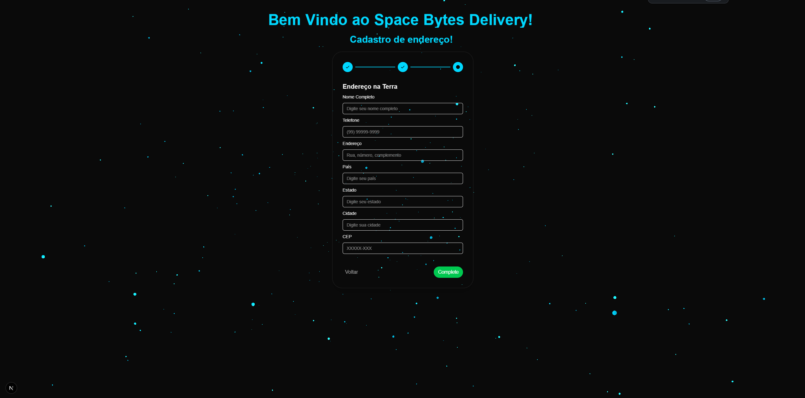
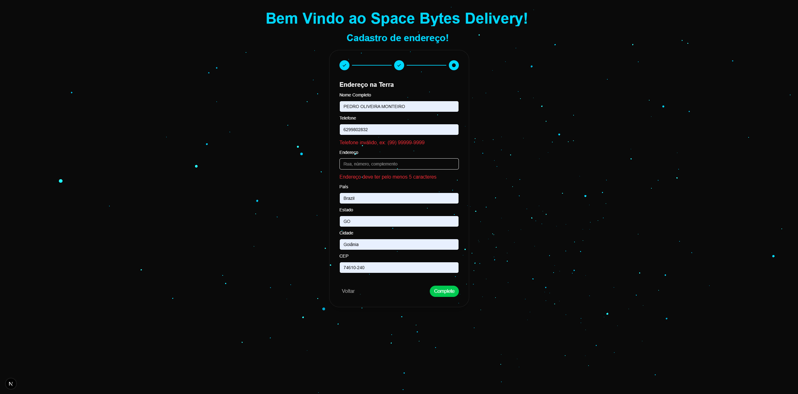
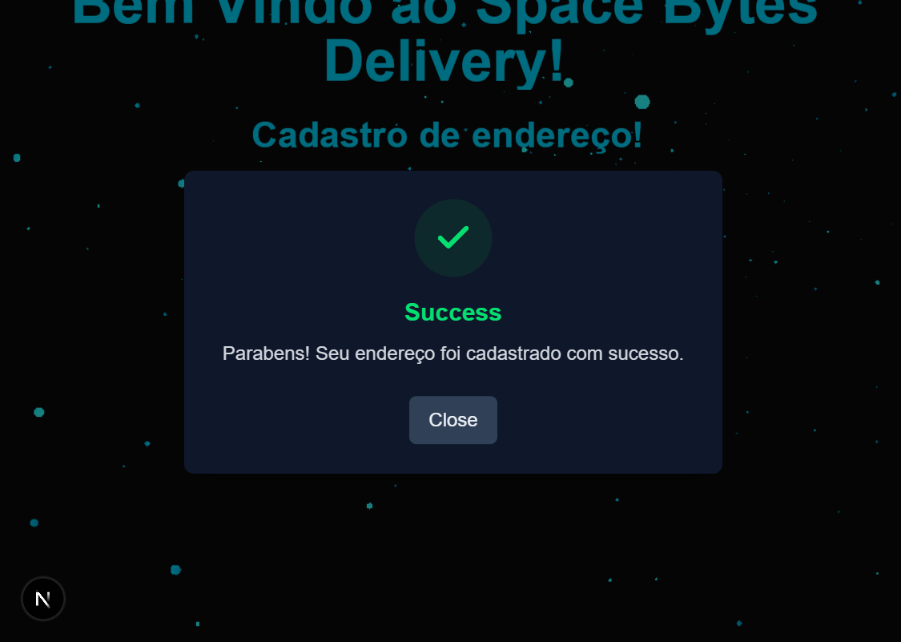

# Space Bytes Delivery 

Este projeto tem como objetivo desenvolver um sistema de delivery interplanetário entre Marte e a Terra. Com a expansão da SpaceX na década de 2050 e a redução dos custos de transporte, a humanidade passou a exportar e importar dispositivos eletrônicos entre os planetas. Este sistema automatiza o processo de cadastro de endereços e armazenamento local dos pedidos.

## Tecnologias


## Índice

- [Space Bytes Delivery](#space-bytes-delivery)
  - [Tecnologias](#tecnologias)
  - [Índice](#índice)
  - [Sobre](#sobre)
  - [Funcionalidades](#funcionalidades)
  - [Instalação](#instalação)
  - [Uso](#uso)
  - [Design](#design)

## Sobre

O **Interplanetary Delivery** foi criado para facilitar o transporte de eletrônicos entre Marte e a Terra. Diferentemente da Terra, onde os endereços são estruturados por países e cidades, em Marte utilizamos lotes de quatro dígitos para identificar as localizações das fábricas e armazéns. O sistema permitirá que usuários cadastrem endereços para envio e recebimento de produtos interplanetários.

## Funcionalidades

- **Cadastro de Endereços**
  Permite que os usuários cadastrem endereços na Terra e em Marte (lotes de 4 dígitos).

- **Armazenamento Local**
  Os endereços cadastrados são armazenados localmente, sem necessidade de backend.

- **Interface Moderna**
  Construída com **Next.js**, **TypeScript** e **Tailwind CSS**, garantindo uma interface responsiva e intuitiva.

- **Escolha de Design**
  Baseado em referências de design pré-definidas para melhor experiência do usuário.

## Instalação

1. Clone o repositório:

   ```sh
   git clone https://github.com/PedrOliveiraM/space-bytes
   ```

2. Acesse o diretório do projeto:

   ```sh
   cd space-bytes
   ```

3. Instale as dependências:

   ```sh
   npm install
   ```

4. Inicie o servidor de desenvolvimento:

   ```sh
   npm run dev
   ```

## Uso

Acesse `http://localhost:3000` no navegador e utilize a interface para cadastrar endereços de envio e recebimento.

## Design





